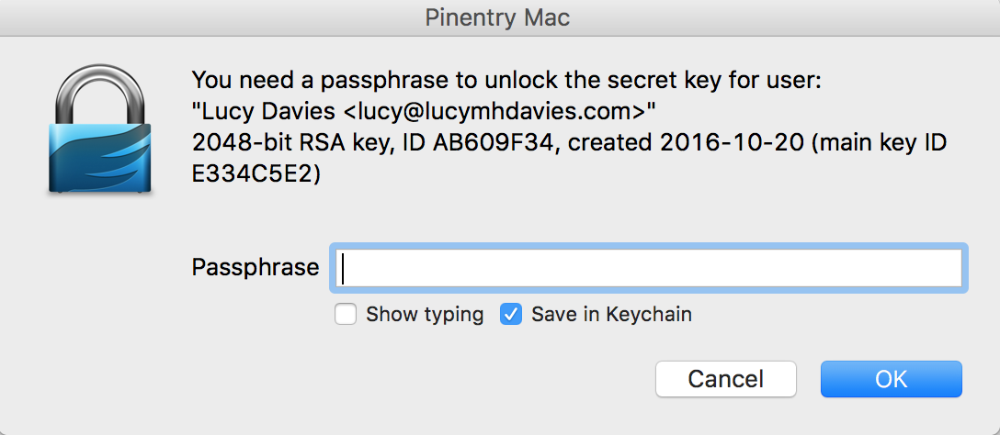
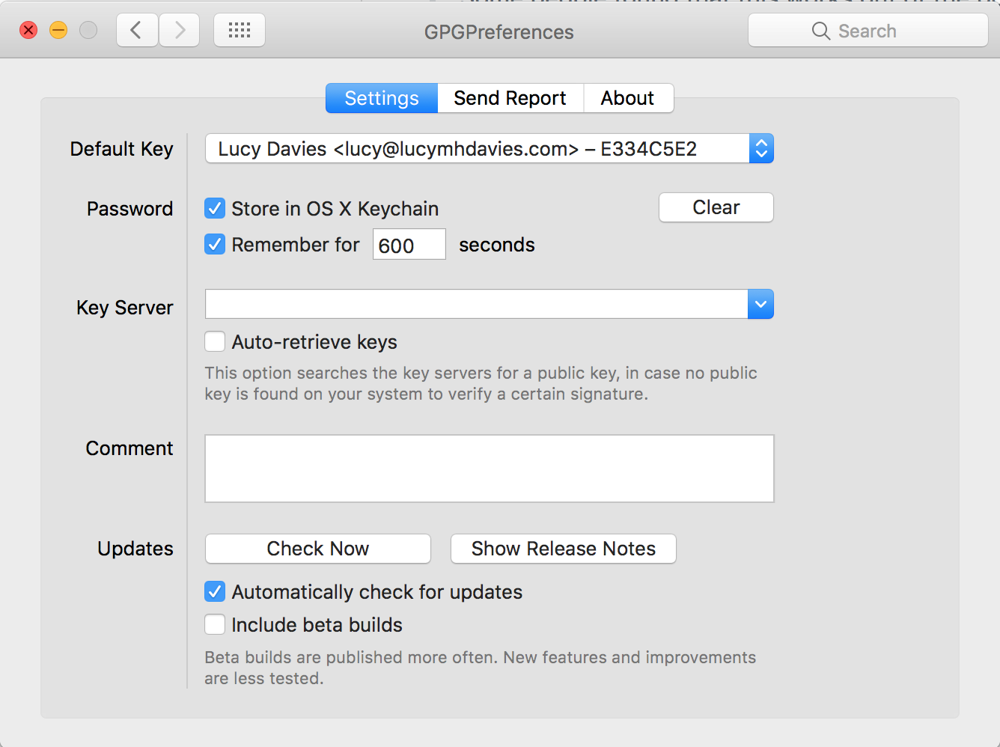

# Set up Keybase.io, GPG & Git to sign commits on GitHub

This is a step-by-step guide on how to create a GPG key on [keybase.io](https://keybase.io), adding it to a local GPG setup and use it with Git and GitHub.

Although this guide was written for macOS, most commands should work in other operating systems as well.

[Discussion](https://news.ycombinator.com/item?id=12289481) on Hacker News.

> **Note**: If you **don't** want to use Keybase.io, follow [this guide][1] instead.
> For manually transferring keys to different hosts, check out this [answer on Stack Overflow][2].

[1]: https://help.github.com/articles/generating-a-new-gpg-key/
[2]: https://stackoverflow.com/a/3176373/571227

## Requirements

```sh
$ brew install gpg
$ brew cask install keybase
```

You should already have an account with Keybase and be signed in locally using `$ keybase login`. In case you need to set up a new device first, follow the instructions provided by the keybase command during login.

Make sure your local version of Git is at least 2.0 (`$ git --version`) to automatically sign all your commits. If that's not the case, use Homebrew to install the latest Git version: `$ brew install git`.

## Create a new GPG key on keybase.io

```sh
$ keybase pgp gen --multi
# Enter your real name, which will be publicly visible in your new key: Patrick Stadler
# Enter a public email address for your key: patrick.stadler@gmail.com
# Enter another email address (or <enter> when done):
# Push an encrypted copy of your new secret key to the Keybase.io server? [Y/n] Y
# ▶ INFO PGP User ID: Patrick Stadler <patrick.stadler@gmail.com> [primary]
# ▶ INFO Generating primary key (4096 bits)
# ▶ INFO Generating encryption subkey (4096 bits)
# ▶ INFO Generated new PGP key:
# ▶ INFO   user: Patrick Stadler <patrick.stadler@gmail.com>
# ▶ INFO   4096-bit RSA key, ID CB86A866E870EE00, created 2016-04-06
# ▶ INFO Exported new key to the local GPG keychain
```

## Set up Git to sign all commits

```sh
$ gpg --list-secret-keys --keyid-format LONG
# /Users/pstadler/.gnupg/secring.gpg
# ----------------------------------
# sec   4096R/E870EE00 2016-04-06 [expires: 2032-04-02]
# uid                  Patrick Stadler <patrick.stadler@gmail.com>
# ssb   4096R/F9E3E72E 2016-04-06

$ git config --global user.signingkey E870EE00
$ git config --global commit.gpgsign true
```

## Add public GPG key to GitHub

```sh
$ open https://github.com/settings/keys
# Click "New GPG key"

# We can then use `export` with the `-q` or query flag to match on our key (the first 16 characters should do..) 
$ keybase pgp export -q CB86A866E870EE00 | pbcopy # copy public key to clipboard
# Paste key, save
```

## Import key to GPG on another host

```sh
$ keybase pgp export
# ▶ WARNING Found several matches:
# user: Patrick Stadler <patrick.stadler@gmail.com>
# 4096-bit RSA key, ID CB86A866E870EE00, created 2016-04-06

# user: keybase.io/ps <ps@keybase.io>
# 4096-bit RSA key, ID 31DBBB1F6949DA68, created 2014-03-26

$ keybase pgp export -q CB86A866E870EE00 | gpg --import
$ keybase pgp export -q CB86A866E870EE00 --secret | gpg --allow-secret-key-import --import
```

## Optional: Set as default GPG key

```sh
$ $EDITOR ~/.gnupg/gpg.conf
# Add line:
default-key E870EE00
```

## Optional: Fix for Git UIs

If you use a UI such as Git Tower or Github Desktop, you may need to configure git to point to the specific gpg executable:
```sh
git config --global gpg.program $(which gpg)
```

## Optional: Disable TTY
If you have problems with making autosigned commits from IDE or other software add no-tty config
```sh
$ $EDITOR ~/.gnupg/gpg.conf
# Add line:
no-tty
```

## Optional: Setting up TTY  
Depending on your personal setup, you might need to define the tty for gpg
whenever your passphrase is prompted. Otherwise, you might encounter an `Inappropriate
ioctl for device` error.
```sh
$ $EDITOR ~/.profile # or other file that is sourced every time
# Paste these lines
GPG_TTY=$(tty)
export GPG_TTY
```

## Optional: In case you're prompted to enter the password every time

> Some people found that this works out of the box w/o following these steps.

### Method 1 - gpg-agent + pinentry-mac

Install the needed software:

```sh
$ brew install gpg-agent pinentry-mac
```

Enable agent use:

```sh
$ $EDITOR ~/.gnupg/gpg.conf
# Add or uncomment line:
use-agent
```

Set up the agent:

```sh
$ $EDITOR ~/.gnupg/gpg-agent.conf
# Paste these lines:
use-standard-socket
pinentry-program /usr/local/bin/pinentry-mac
```

Link pinentry and agent together:

```sh
$ $EDITOR ~/.profile # or other file that is sourced every time
# Paste these lines:
if test -f ~/.gnupg/.gpg-agent-info -a -n "$(pgrep gpg-agent)"; then
  source ~/.gnupg/.gpg-agent-info
  export GPG_AGENT_INFO
  GPG_TTY=$(tty)
  export GPG_TTY
else
  eval $(gpg-agent --daemon --write-env-file ~/.gnupg/.gpg-agent-info)
fi
```

Now `git commit -S`, it will ask your password and you can save it to macOS
keychain.



### Method 2 - GPG Suite

Some people find that pinentry installed with brew does not allow the password to be saved to macOS's keychain.

If you do not see "Save in Keychain" after following Method 1, first uninstall the versions of pinentry-mac and gpg-agent installed with brew:

```sh
$ brew uninstall gpg-agent pinentry-mac
```

Now install the GPG Suite versions, available from [gpgtools.org](https://gpgtools.org/#gpgsuite), or from brew by running:

```sh
$ brew cask install gpg-suite
```

Once installed, open Spotlight and search for "GPGPreferences", or open system preferences and select "GPGPreferences"

Select the Default Key if it is not already selected, and ensure "Store in OS X Keychain" is checked:



The config files edited are the same as in Method 1, however `gpg-agent.conf` is different:

Set up the agent:

```sh
$ $EDITOR ~/.gnupg/gpg-agent.conf
# GPG Suite should pre-populate with something similar to the following:
use-standard-socket
default-cache-ttl 600
max-cache-ttl 7200
```
